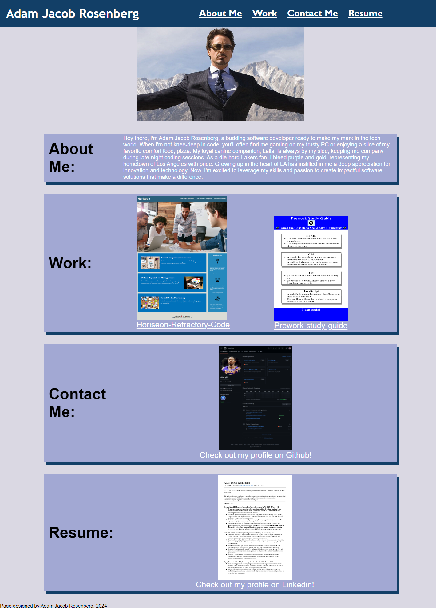

# Adams-Dev-Depot

## Description

### This project demonstrates my freshly acquired coding skills. As I move forward in my career, I aim to regularly update this portfolio to showcase my developing abilities and newly completed projects.

## My portfolio is made to be a flexible and user-friendly website. It is essentially my coding journey and all the cool stuff I've learned up to now.

- I utilized flexbox to create tidy and adaptable layouts, ensuring everything stays well-organized and visually appealing.

- I incorporated media queries to ensure seamless functionality of the site across a range of devices, spanning from smartphones to desktop computers.

- I utilized CSS variables to effortlessly maintain the site's consistent style throughout.

### As my skills progress, this portfolio will keep on expanding!

## Screenshot

## Usage

[Link to Deployed Website](https://acoderrose.github.io/Adams-Dev-Depot/)

[Link to github repository](https://github.com/AcoderRose/Adams-Dev-Depot)

## Collaborators

[Jordan Gonzales](https://github.com/JordanGWiz)

[Kaila Ronquillo](https://github.com/girlnotfound)
